# Weather-Search-Angular
This is a Weather Search Web Application implemented with Angular 8.

Frontend: TypeScript, HTML5, CSS3, Bootstrap

Backend: Node.js with Express

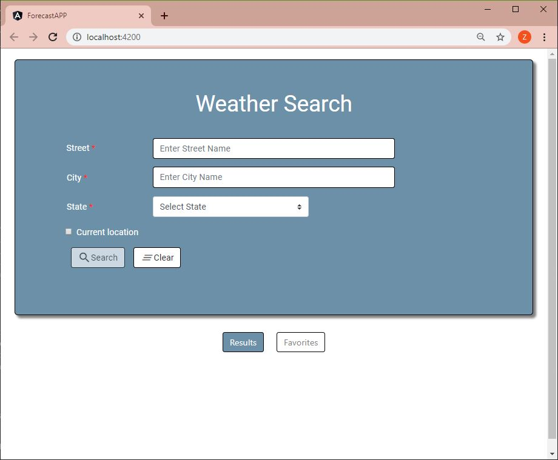
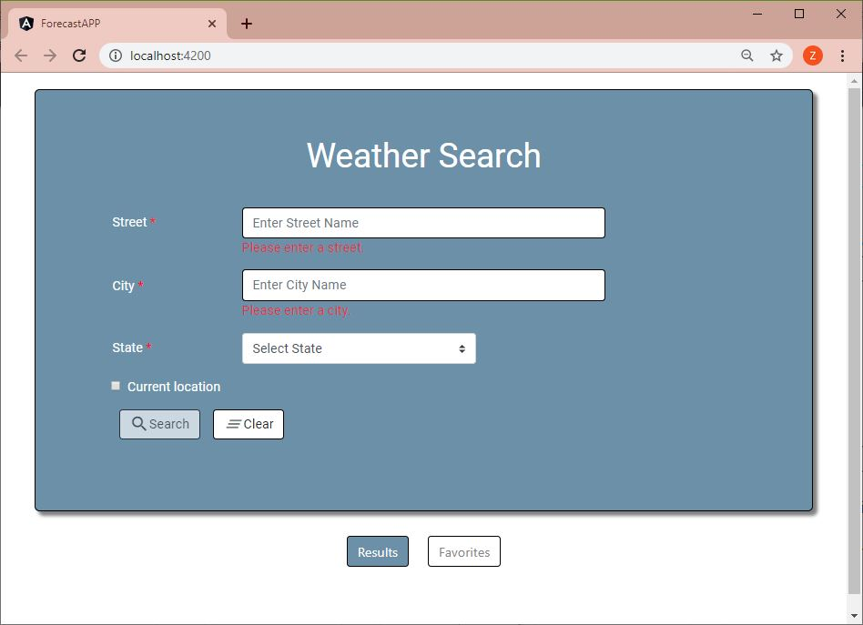
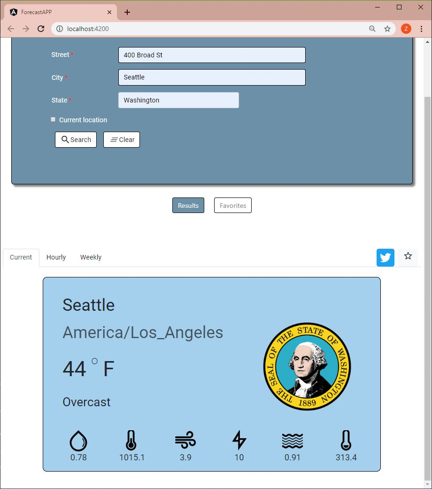
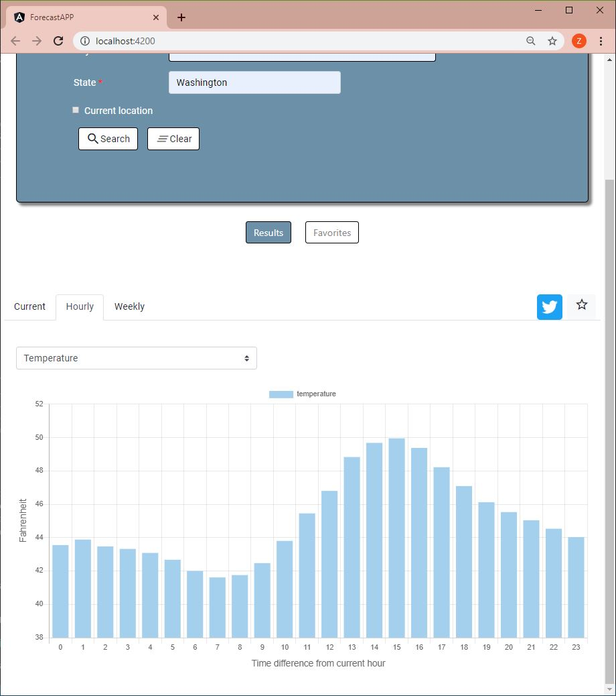
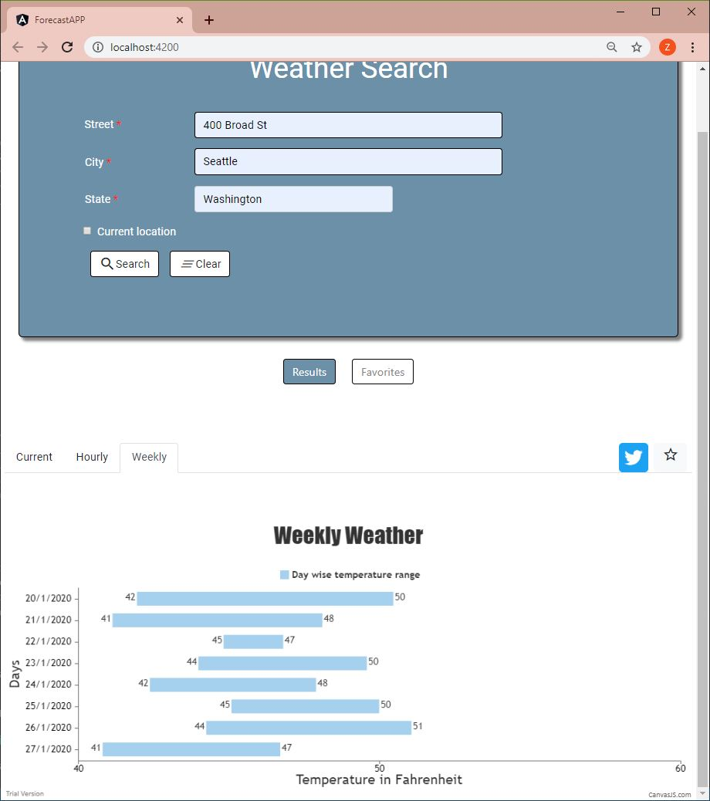
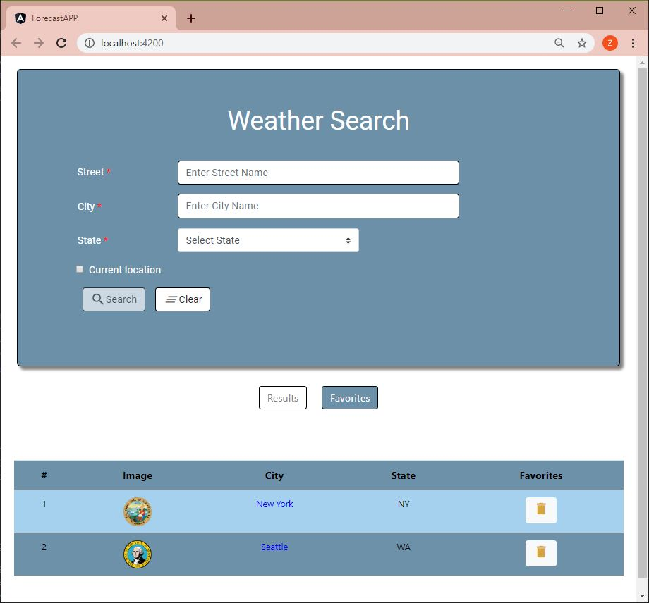
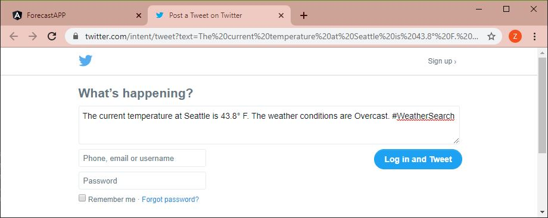

Responsive design on phone size.

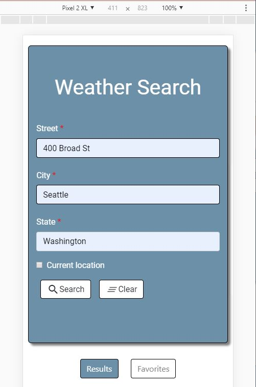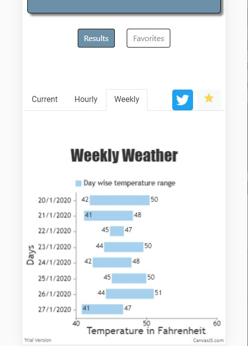
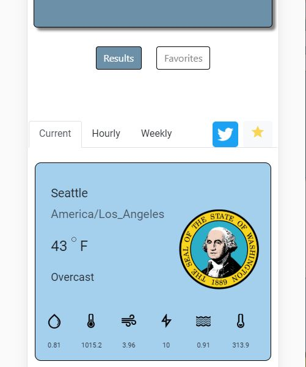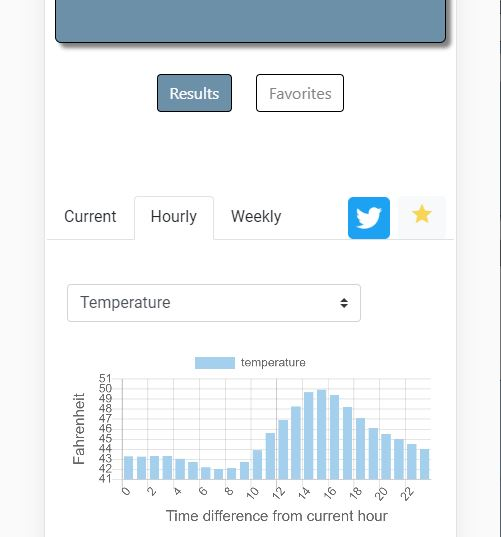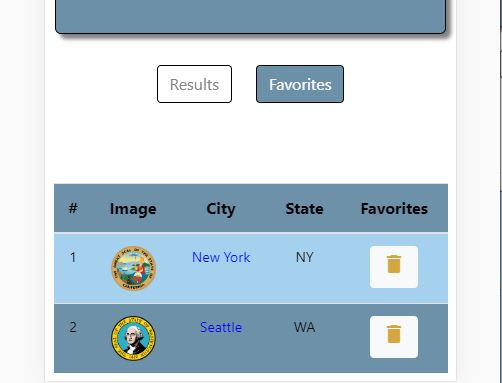
